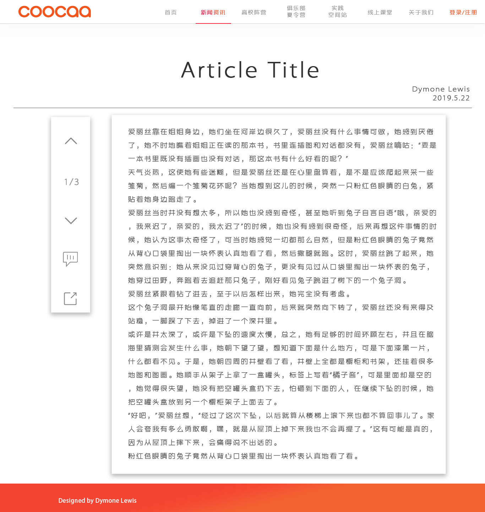

# Coocaa-OffiWeb 开发文档 0.1

前端框架：VUE
UI框架：ElementUI

项目目录结构如下：
coocaa
|
|-build
  |-build.js
  |-check-versions.js
  |-utils.js
  |-vue-loader.conf.js
  |-webpack.base.conf.js
  |-webpack.dev.conf.js
  |-webpack.prod.conf.js
  |-wenpack.test.conf.js
  |-logo.png
|-config
  |-dev.env.js
  |-index.js
  |-prod.env.js
  |-test.env.js
|-node_modules
|-src
  |-assets
    |-css
    |-img
    |-js
  |-components
    |-article(文章)
      |-detail（文章详情）
      |-list（文章列表）
    |-gallery（图册）
    |-home（首页）
    |-login（登录注册）
    |-message（留言）
    |-midBackstage（高校管理员）
      |-index（管理员首页）
      |-reportManage（报表统计）
    |-topBackstage（总管理员）
      |-articleManage（文章管理）
      |-columnManage（栏目管理）
      |-commentManage（评论管理）
      |-galleryManage（图册管理）
      |-index(首页)
      |-messageManage（留言管理）
      |-reportManage（报表管理)
      |-userManage(高校管理员管理)
    |-userInfo（个人资料）
  |-router
    |-index.js
  |-App.vue
  |-main.js
|-static
|-test
|-ui
|-.babelrc
|-editorconfig
|-.gitignore
|-postcssrc,js
|-index.html
|-package.json
|-package-lock.json
|-README.md

### 如果在开发过程中误删了上述结构中的目录/文件，请立刻进行补救

开发时每个人一个分支分支可以自行命名
**不要**使用master分支和中文
自定义css 图片 js文件请放于assets文件夹下的相应文件夹中并规范命名
**切忌**使用aaa、123之类的无意义的命名
各部分模块文件夹已创建好，在本地开发时只要在相应的文件夹下写自己的组件即可，如果出现模块交互情况请与相应的模块开发者联系
**切忌**不沟通直接拉下来

ui如下(详情见ui文件夹)

注册登录UI:

首页UI：

文章UI：

高校阵营UI：

俱乐部夏令营UI:

实践空间站UI：

在线课堂UI:

